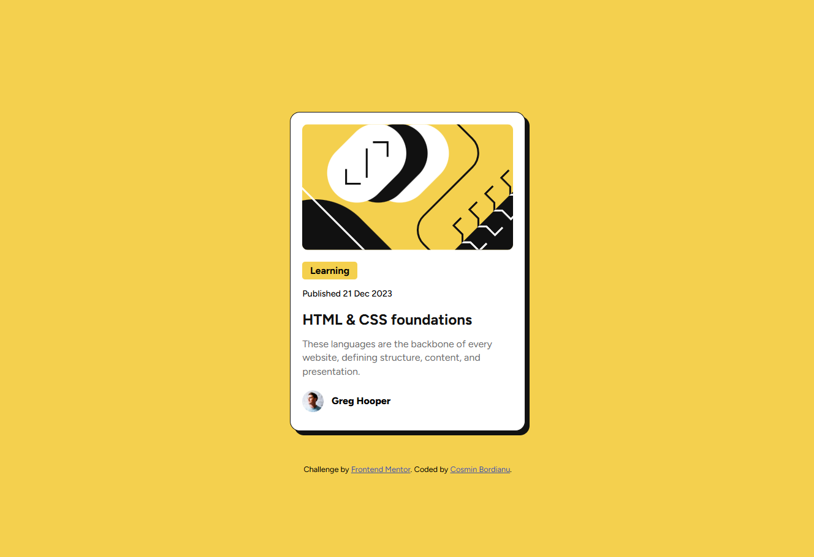

# Frontend Mentor - Blog preview card solution

This is a solution to the [Blog preview card challenge on Frontend Mentor](https://www.frontendmentor.io/challenges/blog-preview-card-ckPaj01IcS). Frontend Mentor challenges help you improve your coding skills by building realistic projects.

## Table of contents

- [Overview](#overview)
  - [Screenshot](#screenshot)
  - [Links](#links)
- [My process](#my-process)
  - [Built with](#built-with)
  - [What I learned](#what-i-learned)
- [Author](#author)

## Overview

### Screenshot



### Links

- Solution URL: (https://majestic-bavarois-81de8d.netlify.app/)

## My process

### Built with

- Flexbox
- CSS Grid

### What I learned

- Variable fonts

```css
@font-face {
  font-family: "Variable";
  src: url(./assets/fonts/Figtree-VariableFont_wght.ttf) format("truetype");
}
```

- CSS grid

```css
body {
  max-width: 100%;
  min-height: 100vh;
  background-color: var(--yellow);
  font-family: var(--primary-font);
  display: grid;
  grid: 1fr min-content / 1fr;
  place-items: center;
  padding: 8.5rem 6rem;
}
```

## Author

- GitHub - [cosminbordianu](https://github.com/cosminbordianu)
- Frontend Mentor - [@cosminbordianu](https://www.frontendmentor.io/profile/cosminbordianu)
